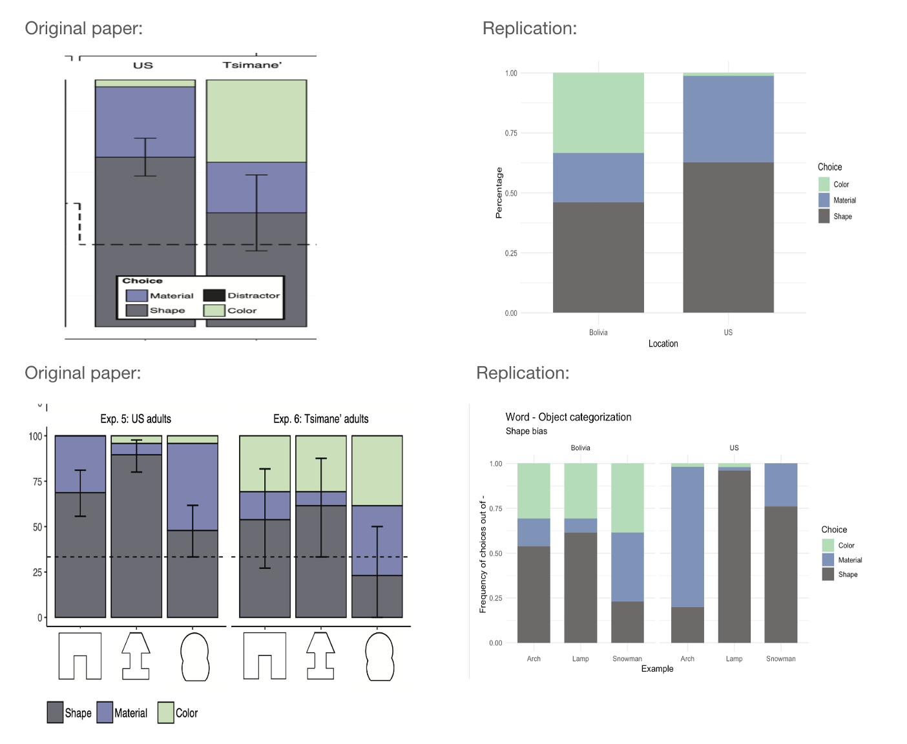

<!-- Replication reports should all use this template to standardize reporting across projects.  These reports will be public supplementary materials that accompany the summary report(s) of the aggregate results. -->

## Introduction

The original paper is discussing the idea of the shape bias. They argue against the shape bias being a result of the language effect on thought, or an innate bias that facilitates the word meaning process. Instead, they hypothesize that shape bias emerges out of environmental factors that affect the kind of categories people encounter and talk about  in their daily life. Their hypothesis goes in line with the statistical regularities hypothesis which argues that the way people talk about things modulates this bias towards shape. 
Their work is a comparison between two populations that vary in the their level of industrialization which are people in the United States and people of the Tsimane’ who are less exposed to industrial artifacts. They compared the strength of shape bias between them. 
the original paper contains 7 experiments, but this replication project will only conduct the 5th experiment.

## Methods

### Power Analysis

I didn't use power analysis. Power analysis for random effects model is complicted and i decided to copy the same sample size from the original paper.

### Planned Sample

The study was done with 144 english speaking adults from the US. They used a termination rule of having a sample size that is large enough to allow them to fully counterbalance all aspects of experimental design.
I am using a similar sample size to the original paper. 

### Materials

For the replication experiment which is experiment 5 in the original article, the study was done online so they used photographs of solid objects that varied in shape, color, and material. 
I contacted the first author of the original paper to provide the photographs. 

### Procedure	

The experiment consisted of three example objects and three extension objects. The experiment was a one-shot learning trials and each participant completed one trial only. in this trial, each participant saw only one example object (counterbalanced across participants) and all extension objects. 
The participant sees a picture of the exempler object on a single screen with a sentence in the top that says something like "this is a yarn" or any other novel name in a sentence of the structure "this is a(n) x". Below, the text read “One of these is also a(n) x” along with three pictures: one shape-matched object, one material-matched object, and color-matched object. A text below also reads “Which one is the other x?” Participants were allowed to select one of the three objects.
They used three different possible labels, randomized across participants. The labels for the US participants were “koba,” “dax,” or “fep”. 

### Analysis Plan

Data cleaning will be in the form of taking only a subset of the data frame that contains the features/columns of interest. No exclusion rule will be applied unless the participant didn't answer the Example at all. 
Then, I will present a simple descriptive statitics of the data by reporting the percentage of participants who extended by shape against those who extended by either color or material. 
Since i will only be testing English-speaking adults from the US, and adding the Tsimane' adult data from the original paper later for comparison, there won't be any interaction effects of age 
I will use a random effects model with exempler type as random interepts to test participant's preference for shape matches as a function of the exempler object. 

**Clarify key analysis of interest here**  Random effects model with random intercepts of exempler type. 

### Differences from Original Study

No differences from the original paper are planned.

### Methods Addendum (Post Data Collection)


#### Actual Sample
 The Actual sample is 142, two participants didn't complete the survey. 

#### Differences from pre-data collection methods plan
 None

## Results


### Data preparation

Data preparation following the analysis plan.
	
```{r include=T}
###Data Preparation
#install.packages("lme4",repos="http://r-forge.r-project.org")
#install.packages("statmod")
#install.packages("lme4")

####Load Relevant Libraries and Functions
library(tidyverse)
library(foreign)
library(tidyr)
library(dplyr)
library(stringr) 
library(ggplot2)
library(here)
library(lme4)
####Import datare
d = read.csv("Jara-ettinger2022_December 1, 2022_18.18.csv")

head(d)

#### Data exclusion / filtering
d_filtered = d %>% select(c("ResponseId", "Q5", "Q9", "Q12"))
d_filtered_long = d_filtered %>% 
  pivot_longer(cols = -c("ResponseId") ,names_to = 'Example', values_to = 'Choice')

#### Prepare data for analysis - create columns etc.

d_filtered_long$Example[d_filtered_long$Example == "Q5"] <- "Yarn" #replace question number with the name of the object that is shown in that question

d_filtered_long$Example[d_filtered_long$Example == "Q9"] <- "Dax"
d_filtered_long$Example[d_filtered_long$Example == "Q12"] <- "Fep"

d_filtered_long$Choice[d_filtered_long$Choice == "IM_eY8Vwfih2OynNCm"] <- "Yarn"  #replace the serial number that identifies the answer choice with the name of the object that corresponds to that choice.

d_filtered_long$Choice[d_filtered_long$Choice == "IM_enDeJ2onL1JrLP8"] <- "Fep"
d_filtered_long$Choice[d_filtered_long$Choice == "IM_5A9xQWROP0v4aPA"] <- "Dax"

d_filtered_long = d_filtered_long %>% filter( !grepl("Import|Response",ResponseId)) #filter some unwanted rows out. 
#is.na(d_filtered_long$Choice)
d_filtered_long$Choice[d_filtered_long$Choice==""] <- NA #replace empty slots with NA
d_filtered_long = d_filtered_long %>% filter(!is.na(Choice)) # maintain only the questions that have answers, i.e. the question that appeared to each participant in the random trial. 

d_filtered_long = d_filtered_long %>% 
  mutate(Match = ifelse(Example == Choice, "Shape", 
                        ifelse(Example == "Yarn" & Choice == "Fep","Color", 
                               ifelse(Example == "Yarn" & Choice =="Dax", "Material", 
                                      ifelse(Example =="Dax" & Choice == "yarn", "Color",
                                             ifelse(Example =="Dax" & Choice == "Fep", "Material",
                                                    ifelse(Example == "Fep" & Choice =="Dax", "Color", "Material"
                                                           )
                                                    )
                                             )
         )
         )
         )
  )
         

d_filtered_long = d_filtered_long %>%
  mutate(Location = "US", Experiment= "US_Adults_Objects") %>% 
  select(c("Experiment", "Example", "Match","Location" ))
colnames(d_filtered_long)[3] = "Choice"

d_filtered_long_summarized = d_filtered_long %>% 
  group_by(Choice, Location) %>%
  summarise( n = n(), Percentage = n / nrow(d_filtered_long))


# length() only gets distinct un-redundant

head(d_filtered_long)

```
``` {r include = T}
# importing the Tsimane data from original paper

d_Tsimane = read.csv("/Users/samahabdelrahim/Desktop/jara-ettinger2022/code/ShapeBias_Data_original.csv")
d_Tsimane_filtered = d_Tsimane %>% select(c("Experiment", "Example", "Choice","Location"))

d_Tsimane_summarized = d_Tsimane_filtered %>% 
  group_by(Choice, Location) %>%
  summarise( n = n(), Percentage = n / nrow(d_Tsimane_filtered))

df_combined <- rbind(d_filtered_long, d_Tsimane_filtered)
df_combined_summarised <- rbind(d_filtered_long_summarized, d_Tsimane_summarized)

df_combined$Example[df_combined$Example == "Yarn"] <- "Arch" #replace question number with the name of the object that is shown in that question

df_combined$Example[df_combined$Example == "Dax"] <- "Snowman"
df_combined$Example[df_combined$Example == "Fep"] <- "Lamp"

```
### Confirmatory analysis

The analyses as specified in the analysis plan.  
If participants used shape matches to extend the word more than they used material or color, then the result is replicated. No comparison will be shown here since i am only testing one population (US adults).

``` {r include = T}

ggplot(df_combined, aes(x=Example, fill = Choice)) +
  geom_bar(position="fill", width = .7) +
  theme_minimal() +
  scale_fill_manual(values = c("#B4DCB9", "#7F92B8", "#6C6969")) +
  scale_x_discrete("Example") +
  scale_y_continuous("Frequency of choices out of 144 trials ") +
  facet_wrap(~Location) +
  labs(title = "Word - Object categorization", subtitle = "Shape bias")


         


ggplot(df_combined_summarised, aes(x = Location, fill = Choice)) +
         geom_bar( aes(y = Percentage), stat = "identity", width = 0.7) +
         theme_minimal() +
         scale_fill_manual(values = c("#B4DCB9", "#7F92B8", "#6C6969" ))
         
```

``` {r include = T}
# Statistical analysis

data_new <- d_filtered_long      
data_new$Choice[data_new$Choice == "Shape"] <- 1
data_new$Choice[data_new$Choice == "Material"] <- 0


#using the combined data
m <- glmer(Choice=="Shape" ~  Location  + (1 + Location| Example) ,df_combined,family="binomial")
#m <- glmer(Choice=="Shape" ~  Location  + (1 + Location| Example) + (1 | Experiment),df_combined,family="binomial")
summary(m)
```
*Side-by-side graph with original graph is ideal here*
 
Matches by shape are more than matches by other attributes like material or color for the US articipants. 
Breaking down US replication data by items showed a great magnitude of variance.
A random effects model yielded an unsignificant result with a p-value of 0.318 and a small estimate of 1.138. 




 
###Exploratory analyses

Replicating the study with Mutli-trials paradigm of learning could possibly change the results. 
Also, testing with a broader variation in items, i.e. more items that differ in perspective solidity, color, and material would be ideal to better understand items variation. 

## Discussion

### Summary of Replication Attempt
The study partially replicated with US participants generally generalizing more by shape than the Tsimane'. However, repsonses by item differed from the original study with much more variation across items. Additionally, the replication wasn't significant with respect to a random effect model with random intercepts of items. 

### Commentary

Future work could include a larger scale of this paradigm with more items and wider variations. 
